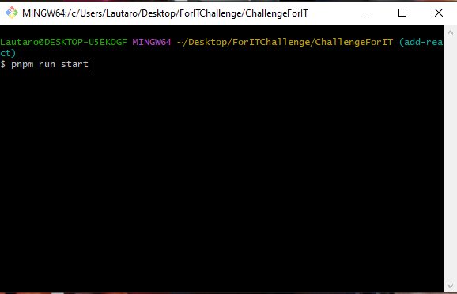
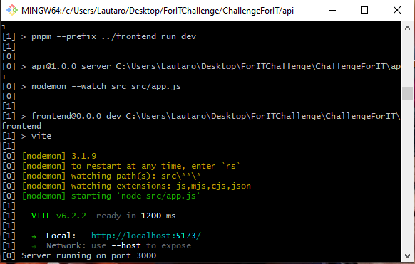
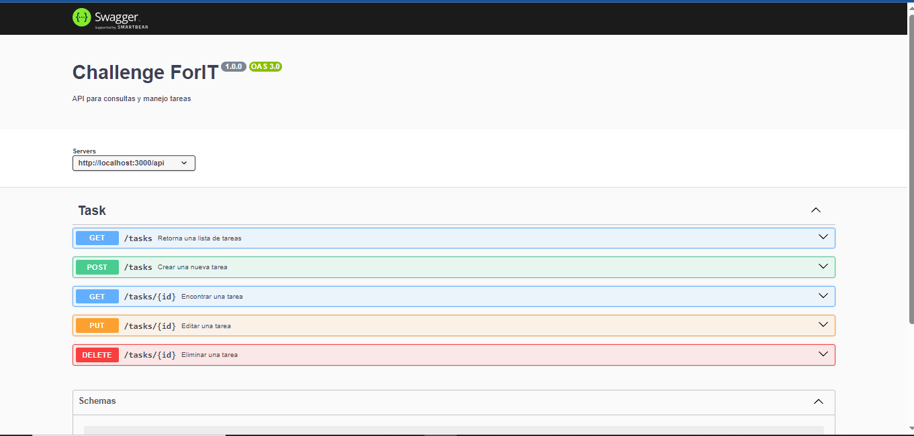
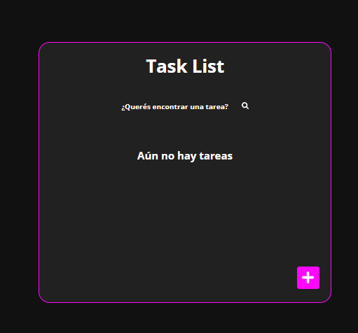
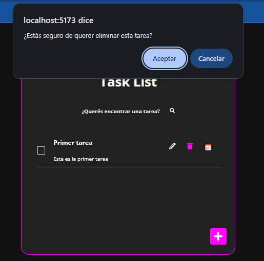
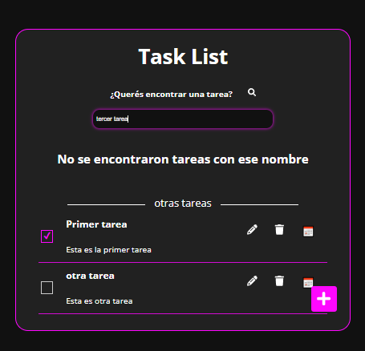

## 🚀 Cómo ejecutar la aplicación localmente

1. **Clona el repositorio**  
   Abre una terminal (puedes usar Git Bash o la terminal de tu preferencia) y ejecuta el siguiente comando para clonar el repositorio desde GitHub:

   ```bash
   git clone https://github.com/Lautaro-Juarez/ChallengeForIT.git
   ```

   También puedes hacerlo directamente desde la interfaz de GitHub si prefieres usar la opción de "Clone or Download".

2. **Accede al directorio del proyecto**  
   Una vez clonado el repositorio, navega a la carpeta del proyecto ejecutando:

   ```bash
   cd ChallengeForIT
   ```

3. **Instalar dependencias**  
   En el directorio del proyecto, instala todas las dependencias necesarias con el siguiente comando:

   ```bash
   pnpm install
   ```

4. **Configura el archivo `.env`**  
   Es necesario crear un archivo `.env` en las raíces tanto del proyecto **backend** como del **frontend**. Dentro de estos archivos, debes agregar las siguientes configuraciones:

   - **Backend** (`.env` en el proyecto backend):  
     ```env
     PORT=3000  # O el puerto que prefieras para el backend
     ```

   - **Frontend** (`.env` en el proyecto frontend):  
     ```env
     VITE_API=https://localhost:<puerto-del-backend>/api  # Asegúrate de colocar el puerto del backend que elegiste
     ```

5. **Ejecutar el backend**  
   Para ejecutar el proyecto del backend, navega a la carpeta del backend:

   ```bash
   cd /api
   ```

   Luego ejecuta el servidor backend con el siguiente comando:

   ```bash
   pnpm run start
   ```

6. **¡Listo!**  
   El proyecto debería estar corriendo localmente. Si todo salió bien, puedes acceder a la aplicación en el navegador. 🎉







